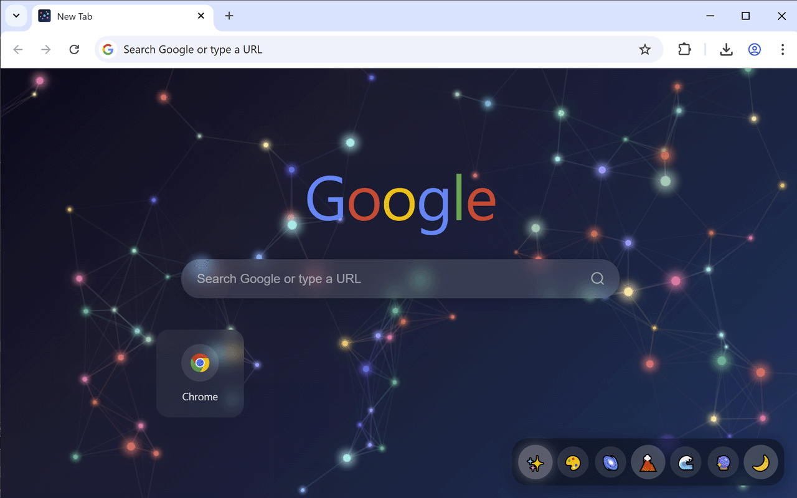
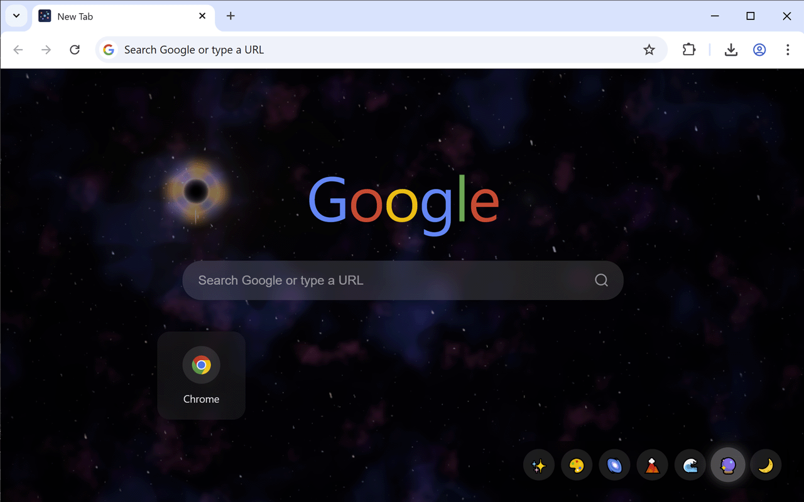
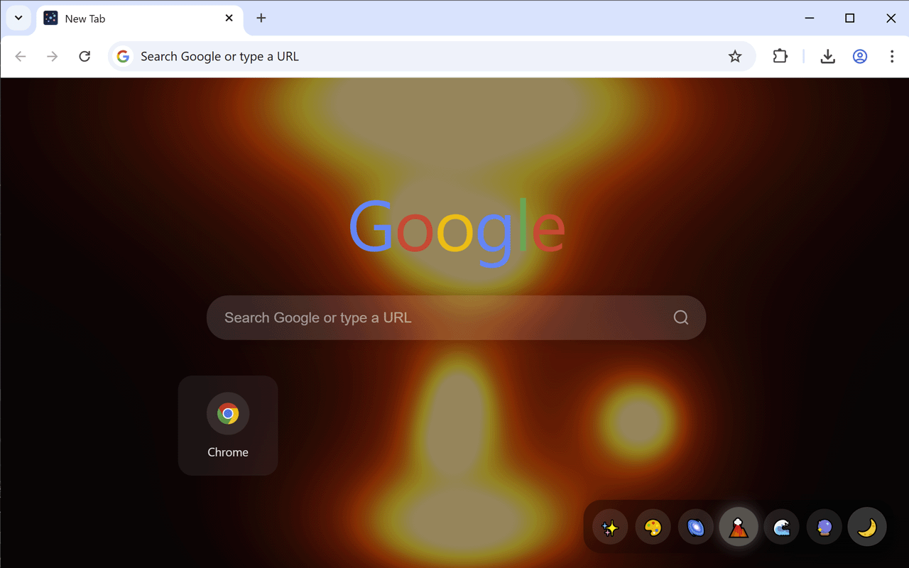

# Amazing New Tab

A Chrome extension that transforms your new tab page with 8 stunning animated themes.

> ⚠️ **Note:** This extension uses GPU/CPU intensive animations. May affect battery life on laptops. Animations auto-pause when tab is hidden to save resources.

.png)

## Features

- **8 Animated Themes**: Particles, Paint, Aurora, Lava Lamp, Ocean, Nebula, Fireflies, Grid
- **Interactive Mouse Effects**: Each theme responds to mouse movement
- **Top Sites Shortcuts**: Quick access to your most visited sites
- **Auto-Pause**: Animations pause when tab is hidden to save CPU/GPU
- **Smooth Transitions**: Seamless switching between themes

## Themes

### Particles
Colorful floating particles with smooth motion and mouse interaction.

### Paint
Flowing paint shader effect with vibrant colors.

### Aurora
Northern lights effect with dynamic color waves.

### Lava Lamp
Organic metaball blobs with pulsating ellipse shapes, smooth color gradients, and mouse-following behavior.

### Ocean
Deep ocean water simulation with light rays and caustic effects.

### Nebula
Space nebula with:
- Procedural star field
- Shooting stars/meteors
- Black hole with gravitational lensing effect
- Rotating sky view

### Fireflies
Gentle glowing fireflies floating in the night.

### Grid
Interactive dot matrix with rainbow colors - dots scatter from cursor and return to their positions.

## Screenshots

## Installation

### From Chrome Web Store
Search for "Amazing New Tab" in the Chrome Web Store.

### Manual Installation (Developer Mode)
1. Download or clone this repository
2. Open Chrome and go to `chrome://extensions/`
3. Enable "Developer mode" (toggle in top right)
4. Click "Load unpacked"
5. Select the extension folder

## Usage

1. Open a new tab - the extension automatically replaces the default new tab page
2. Click theme icons at the bottom to switch between animated backgrounds
3. Click on shortcuts to visit your frequently used sites

## Permissions

- **storage**: Save your theme preference
- **topSites**: Display your most visited sites as shortcuts

## License

MIT